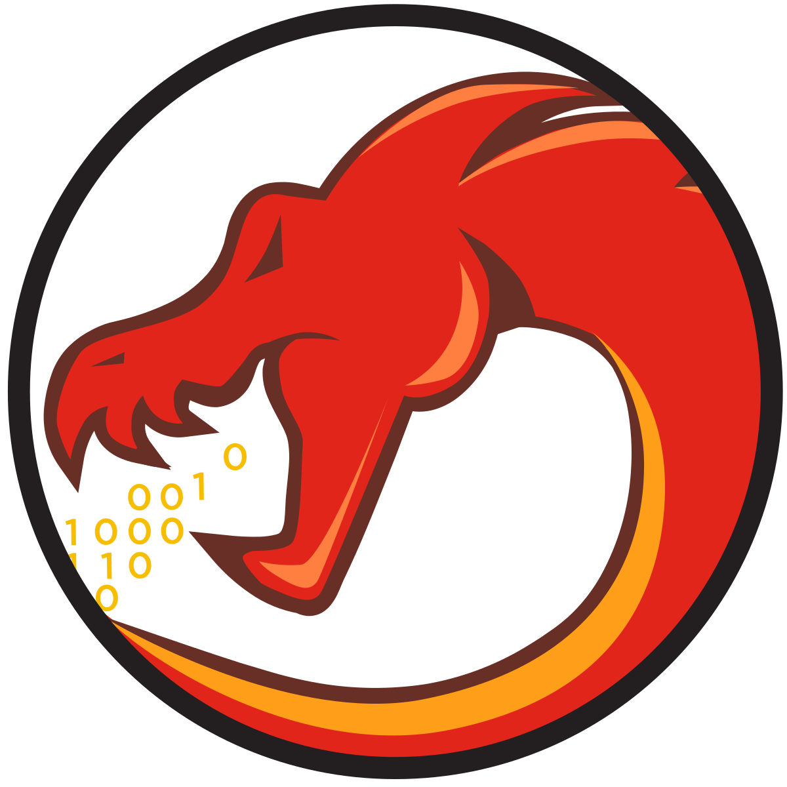

# FridaHook

FridaHook is a Python script designed to simplify the process of creating a Frida snippet. It achieves this by enabling you to generate a snippet by merely selecting a function's address. The generated snippet is then stored in a file named script.js and simultaneously presented within the Ghidra console.
